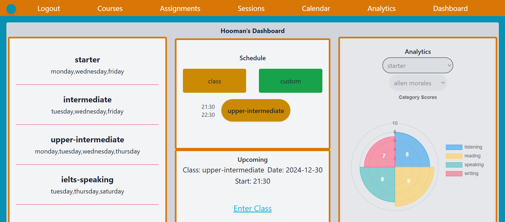
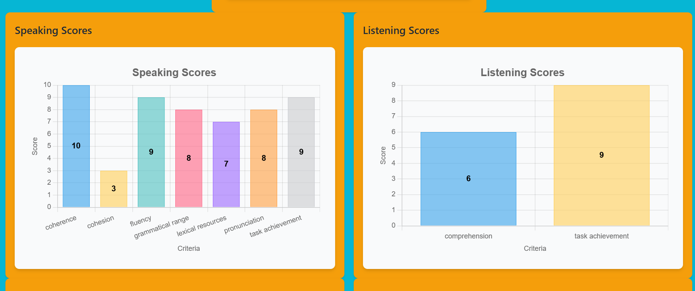
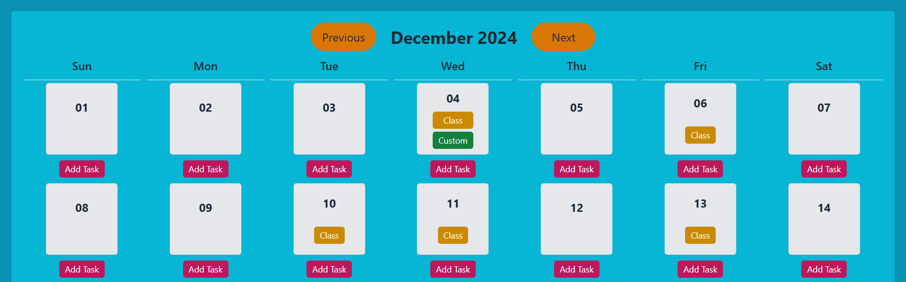
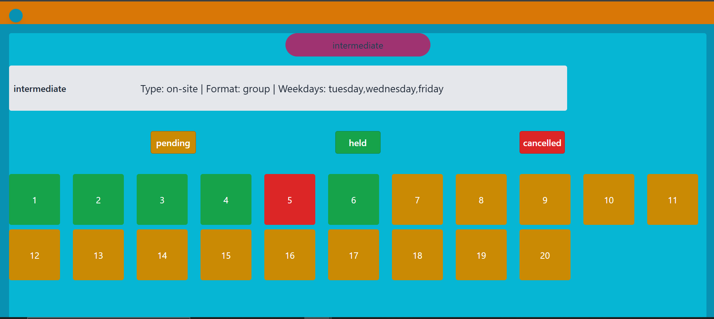
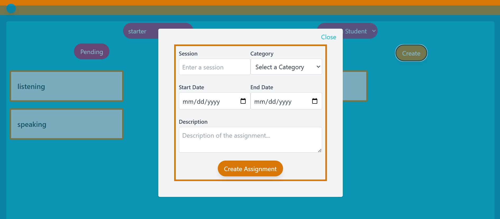
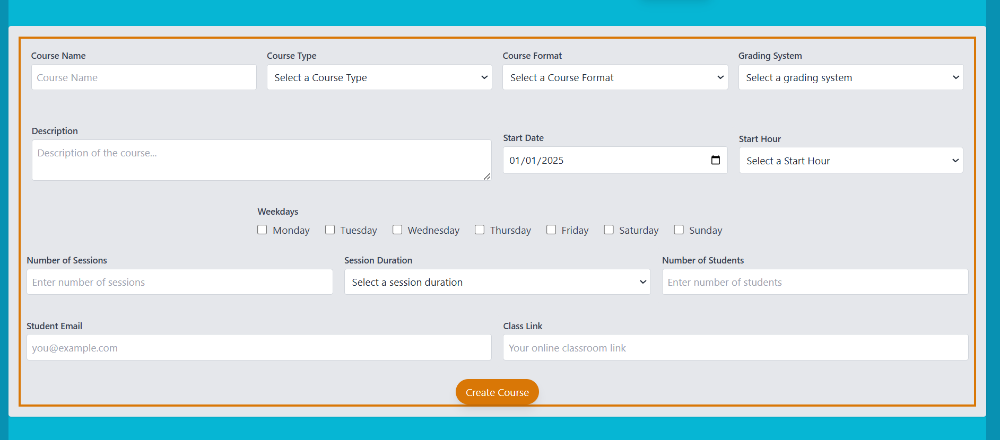

# EZtutor

**EZtutor** is a webapp project designed to help language tutors and their students to manage their classes with ease.

## Table of Contents

- [Description](#description)
- [Features](#features)
- [Design Specifics](#design-specifics)
- [Prerequisites](#prerequisites)
- [Technologies Used](#technologies-used)
- [Usage](#usage)
- [Screenshots](#screenshots)
- [Contributing](#contributing)
- [Contact](#contact)

## Description

EZTutor is a web application designed specifically for managing language classes for both tutors and their students, whether conducted online or in-person. Teachers can create courses, assign and grade assignments, monitor student performance through intuitive visual displays, and manage each session efficiently. Additionally, the platform offers personal calendars for users to organize and keep track of their schedules seamlessly.

**Motivation:** As a tutor myself, I always felt the need a handy and easy-to-use tool that helps me keep track of my classes and allow me to focus on teaching rather than organizing.

**Challenges:** As the size of this project was way bigger than I expected when I started it, it required tremendous hours of work and study to be able to finish it with an acceptable result. There is a lot of room for improvements, naturally, but it would be beyond the scope of an end-course project such as this.

**Intened Users:** At its current state, this is a tool tailored for <ins>language</ins> tutors and their students but their is definitely the potential to be extended for all the other fields of study too.

## Features

- **User Authentication:** Teachers and students can create their own account safely and securely.

- **Ensured integrity of data:** both front and backend data entries and queries are safeguarded by validators working separately.

- **Limited access:** Each user and user type can only access the information they are suppose to via id and user type checks before any access.

- **Course creation:** Teachers can create courses using forms with ease.

- **Assignment handling:** Teachers can create and score assignments, and students can submit them all in one place.

- **Personal calendars:** Each user is equipped with a personal calendar where their classes are automatically added to and they can also create their own custom tasks to help them keep track of their schedule in one place.

- **Sessions:** Sessions section will show a simple view of all sessions to users where teachers can edit each session's information and students can view its notes.

- **Simple Analytics:** Using intuitive charts, students and also their teachers can view their performance and get insights on their strengths and weaknesses.

- **Dashboard**: A section where all the important information like course names, today's schedule, upcoming session and overview of performance analytics can be seen. 

- **Decorator-based access:** Routes are protected by decorators so that if user tries to bypass frontend restrictions, they wouldn not be able to access the database if they are not suppose to.

- **Form-based data entry:** To make sure user mistakes are lowered as much as possible, almost all data entry or query is done via forms with front and backend validations.

- **Emailing system:** The webapp has its own emailing system where invitations to class and assignment submissions are done automatically without a need for user to exist the webapp environment.

- **No limitation on registry type:** Duo to the database schema, a user can create an account as teacher or student with the same email if they decide to.

- **Scoring system choices:** Teachers can choose what type of scoring system they want to incorporate in each course. Currently the options are *Numeric* and *Descriptive*.

- **Tag-based scoring:** Regardless of scoring system each category of *speaking*, *listening*, *writing*, and *reading* have their own predefined tags to help teachers assess their students with higher precision.

- **Minimal data entry:** The design was focused in a way to provide users with as many select-type options as possible so they wouldn't be forced to manually enter data.

- **Modular Design:** To enable maintainability and reduce redundancy, each page was assigned a blueprint with it's own html and routes and script file. Also all queries, configurations, extensions, emails, forms and their html renders, decorators, SQLAlchemy models and choices were separate into their own files.

## Design Specifics

**Database:** Data base uses two separate tables for teachers and students and due to nature of relationships, includes the followoing tables:
- Teacher
- Student
- TeacherStudent (join)
- Course
- CourseWeekday
- CourseStudent (join)
- Session
- SessionStudent (join)
- Assignment
- AssignmentStudent (join)
- TagCategory
- Score
- CustomTask

**Queries:** To leverage SQLAlchemy model-based queries rather than raw SQL queries, A file called *queries.py* was dedicated to creating functions of queries where depending on different combination arguments provided, will query and output result accordingly. This decision was made so that the number of functions used could be kept as few and as practical as possible. Queries are many in nature of fetch (with prefix of *find*) and update (with prefixes of *add* or *update*).

**HTMLs:** Each page was dedicated only one html to keep things as clean as possible. That being said, to address queries, API based approach was chosen where using live fetch request sent via "GET" and "POST" request through predifined and isolated routes, front-end's communication with back-end and database was established.

**Scripts:** As mentioned in HTML part, to make live fetch requests possible, JavaScript was utilized. To simplify and maintain a singular approach, *Alpine.js* with an Object Oriented strategy was incorporated. In other words, each html was given an object with the same name which would handle client-side interactions using its properties and methods. This way, all the functions would be connected to the same object, resulting in more maintainable where conflicts between each function (methods of the object) could be minimized.

**Forms:** To handle backend validations, *Flask-forms* and *WTForms* were used for the most part. Also to keep htmls clean and manageable, forms were rendered in back-end. All the forms and their htmls can be found in *forms.py*.

**Decorators:** To handle route safety, database integrity and authentication check, decorators were created and all can be found in *decorators.py*. This is one of many ways used to ensure back-end safety.

**extensions:** To avoid circular imports all major setups where added to *extensions.py*. This way other modules can safely access them without creating conflict.

**Emails:** All email related functionalities where placed in *emails.py*. Here using flask-mail messages are created and their html is rendered to keep things clean and maintainable.

**Choices:** Since most of user's interaction with back-end happens through forms, all the choices provided in these forms where gathered and stored in *choices.py* to make configuration for future easier and more robust.

**Flask-login:** Flask-login was incorporated to keep track of the logged user and simplify checks and authentication.

**Tailwind:** To simplify styling with minimum custom CSS, tailwinds extensive library was utilized to keep editing manageable.

**AOS:** For some basic animations, other than Tailwind *Animate On Scroll* library was included to create a better UI.

## Prerequisites
- [python] version 3.12.6
- [MYSQL] version 8.0.40
- [Alpine.js] version 3.x.x
- [Chart.js]
- [Tailwind]
- [AOS] version 2.3.4

**Packages:** The list of packages used is long and you can find all in *requirments.txt* file.

## Technologies Used:

- **Front-end:**
    - HTML5
    - CSS3
    - JavaScript
    - Alpin.js
    - Tailwind
    - Chart.js
    - AOS (Animate On Scroll)
- **Back-end:**
    - Python
    - Flask
    - SQLAlchemy
    - MYSQL

## Usage:

Here is how you can user EZtutor:

**Register:** Register as teacher or student

**Login:** Login as the user type you created an account for

- **Teachers:**
    - Create courses and invites students to join them via automated links.
    - Create assignment and score them after they are submitted.
    - View and update session status and information.
    - View and add tasks to your personal calendar.
    - View student performance for each category and tag.
    - All-in-one view in dashboard.
- **Students:**
    - Join courses via links shared by teachers
    - Submit and view your assignments via automated emailing system that uploads and sends your assignments.
    - View session information.
    - View and add tasks to your personal calendar.
    - View your performance for each category and tag.
    - All-in-one view in dashboard.

## Screenshots

**Teacher Dashboard**

**Teacher Analytics**

**Teacher Calendar**

**Teacher Sessions**

**Teacher Assignments**

**Teacher Courses**

## Contributing

While all the solutions, design choices and approaches where made by me, I heavily relied on *Chat GPT* on syntax inquiries and possibility checks. In other words, to check if a plan or design is applicable given the tools and technologies I wanted to use. Also some proofreading was also done by Chat GPT to ensure there are as few bugs as possible.

## Contact

To contact me you either email me or message me on Twitter:

- **Email:** hoomanjaafari@gmail.com
- **Twitter:** [hoomanxj](https://x.com/hoomanxj)
